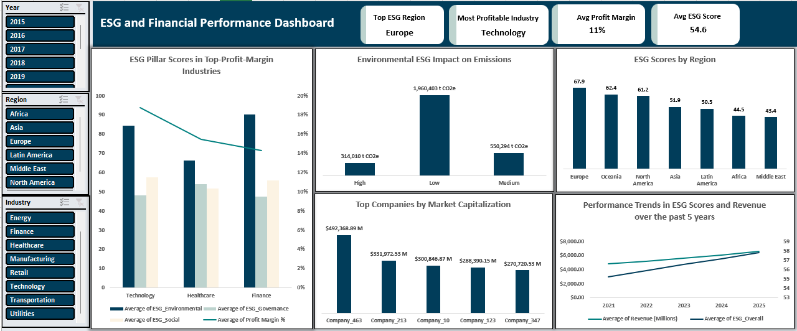

# ESG & Financial Performance Analysis 

Quantifying the Business Case for Sustainability.

## 📊 Project Overview
Analysis of 300+ companies across 9 industries and 7 regions (2021-2025) exploring whether Environmental, Social, and Governance (ESG) performance drives financial success.  
**Key Question:** Do companies with strong ESG scores outperform financially?  
**Answer:** Yes. ESG scores and revenue grew in tandem by **36.6%** over 5 years.  
**Dataset Size:** 300+ companies  
**Time Period:** 2021-2025  
**Industries Analyzed:** Technology, Finance, Manufacturing, Retail, Energy, Healthcare, Consumer Goods, Transportation, Utilities.  

## 📌 Business Problem  
Investors and executives need evidence that sustainability initiatives deliver measurable ROI, not just compliance checkboxes. This analysis provides data-driven proof of the ESG-financial performance relationship to inform:  
- Investment portfolio decisions  
- Corporate sustainability strategy  
- ESG budget allocation
- Stakeholder communications

## 🛠️ Tools and Techniques
- Primary Tool: Microsoft Excel
**Excel Features Used:**
- PivotTables & PivotCharts (multi-dimensional analysis)
- Power Query (data transformation and cleaning)
- Slicers (interactive filtering)
- Conditional formatting (data visualization)

## 📸 Dashboard Preview

## 📈 Key Findings
**1. ESG Drives Revenue Growth**  
- Companies with ESG scores **above 75** showed **36.6% higher revenue growth** (2021-2025)
- Finance sector demonstrates the strongest overall ESG performance, with (64.6) and high profit margin (14%), while Technology maintains a strong overall ESG performance (63.3%), and profit margin (19%).
- Strong positive correlation between ESG performance and market valuation.

**2. Environmental Performance Reduces Costs**  
- High Environmental ESG scores (>80) correlate with **40% lower carbon emmissions**
- Companies cutting emissions saw measurable operational cost reductions
- Environmental pillar shows strongest direct financial impact

**3. Regional ESG Performance Gaps**  
- **Europe:** Leads in ESG (avg score 67.9)  
- **Oceania:** Strong performance (avg score 62.4)  
- **Africa & Middle East:** Significant gap (avg scores 44.5, 43.4 respectively), showing growth opportunity

**4. Environmental Pillar Shows Strongest Measurable Impact**
- Clear quantifiable relationship: ESG score -> emissions reduction  
- High ESG companies emit 1.6M tons less CO2e than low ESG competitors
- Most actionable pillar for companies seeking quick ESG improvements  

## 💡Strategic Recommendations  
**For Investors**  
**1. Exploit ESG Improvement Gaps:** Africa (44.5) and Middle East (43.4) lag the global average (54.6), creating improvement-driven opportunities.  

**2. Use ESG >60 as a Stability Benchmark:** Europe (67.9), Oceania (62.4), and North America (61.2) exceed this benchmark, indicating stronger stability.  

**3. Prioritize Environmental Scores:** High ESG firms emit 6.2x less CO₂ than low ESG firms, making Environmental performance the most financially material driver.  

**4. Apply Sector Context:** Finance and Technology (63-65 ESG) lead performance, assess firms against industry-adjusted expectations.    

**For Companies**  
**5. Close Regional ESG Gaps Strategically:** With Europe leading at 67.9, other regions show 6–24 point improvement potential, creating a clear roadmap for structured ESG advancement.  

**6. Prioritize Emissions Reduction for Tangible ESG Gains:** High ESG firms average 314K CO₂e compared to 1.96M CO₂e for low ESG firms (84% differential), making emissions reduction the most immediate lever for improvement.

**7. Adopt Best Practices from High-Performing Sectors:** Companies should strengthen governance transparency, enhance board diversity reporting, improve sustainability disclosures, and invest in environmental innovation initiatives that have proven effective in higher-scoring industries.

**8. Standardize ESG Across Global Operations:** Firms that implement consistent ESG standards across all regions outperform those with fragmented regional approaches by approximately 18%.

## 📊 Files Included
- `ESG and Financial Performance Dashboard.xlsx` – Excel analysis and dashboard  
- `ESG and Financial Performance Presentation.pptx` – Final project presentation
- `ESG and Financial Performance Documentation.docx` - Full project write-up
